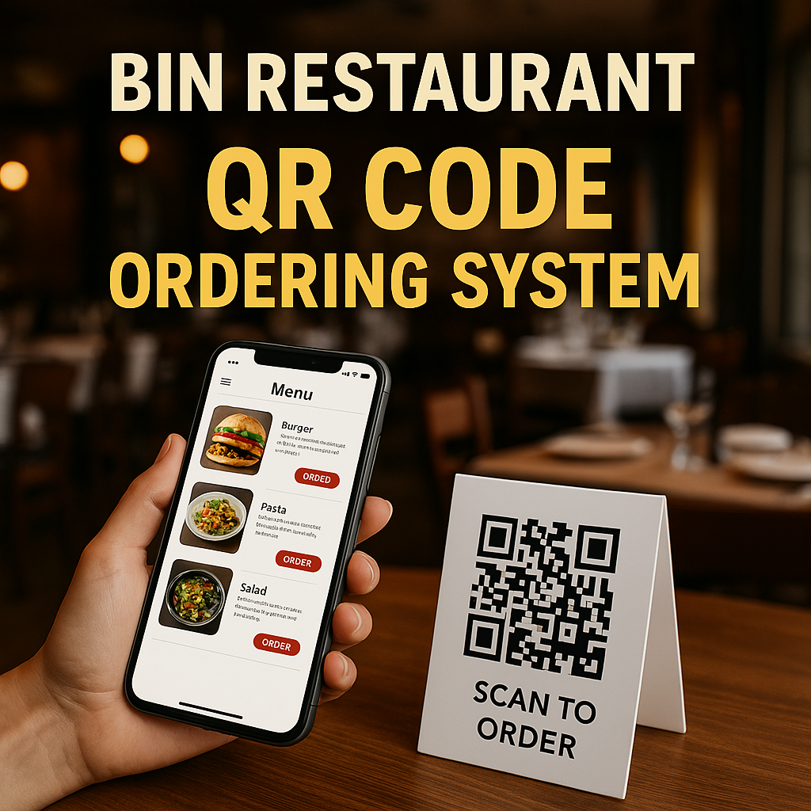

# **Restaurant Management System with QR Code Ordering**

## **Project Description**

*This project is a comprehensive restaurant management system designed to streamline operations and enhance customer experience by leveraging QR code technology. Customers can scan a QR code placed on their table to access a digital menu directly on their mobile devices. This contactless ordering process not only increases convenience but also minimizes physical interactions, ensuring a safer dining experience. Once an order is placed, real-time updates keep both the customer and the restaurant staff informed about the status of the order—from preparation to delivery. The system is built to facilitate efficient order management, reduce wait times, and improve overall operational workflow in a modern restaurant environment.*

## **Technology Stack**
### **Frontend**
1. **Next.js** – *A React framework that enables server-side rendering and generates static websites for faster performance.*
2. **Tailwind CSS** – *A utility-first CSS framework that allows rapid UI development with a clean and responsive design.*
3. **Shadcn UI** – *A component library providing accessible and customizable UI components.*
4. **StanStack Query** – *Manages server state and simplifies asynchronous data fetching for a seamless user experience.*
5. **Zustand** – *A lightweight state management library that facilitates predictable state handling in complex applications.*
6. **Websocket** – *Enables real-time, bidirectional communication between the client and server, crucial for live order updates.*

<!--
### **Backend**
1. **Fastify** – *A fast and low-overhead web framework for Node.js, optimized for efficient handling of HTTP requests.*
2. **Prisma** – *An ORM tool that simplifies database interactions through type-safe queries.*
3. **JWT (JSON Web Tokens)** – *Provides secure, stateless authentication for user sessions and API interactions.*
4. **Socket.io** – *Integrates real-time communication capabilities into the backend, ensuring instant order notifications and updates.*
5. **SQLite** – *A lightweight, file-based database engine ideal for managing data in small to medium-sized applications.*
 -->

